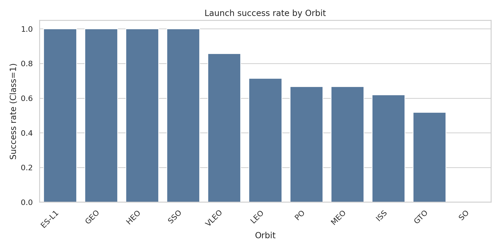
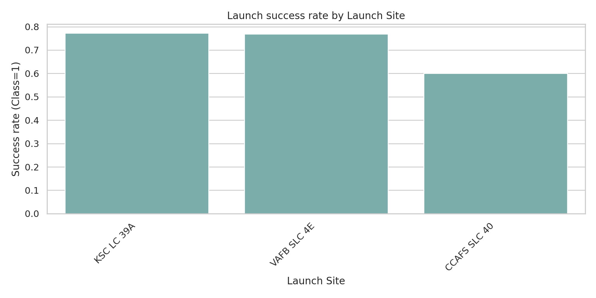
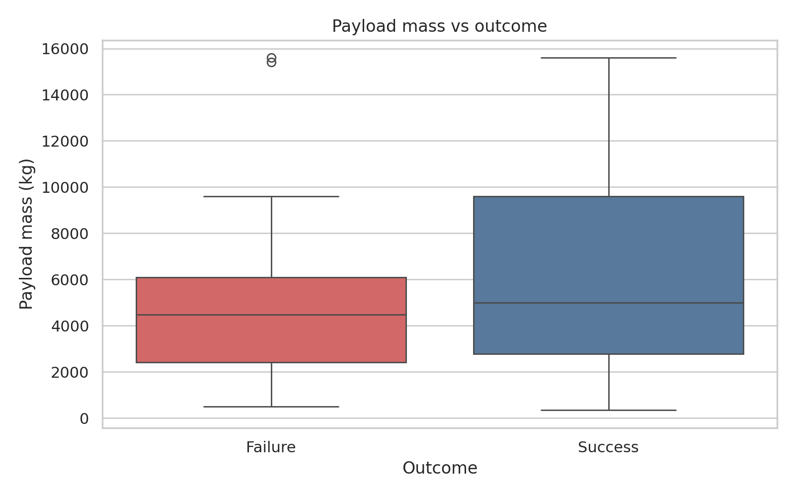
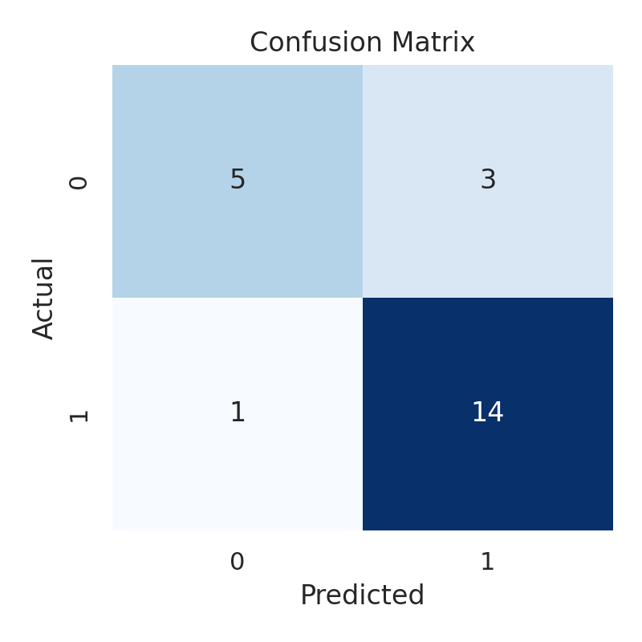
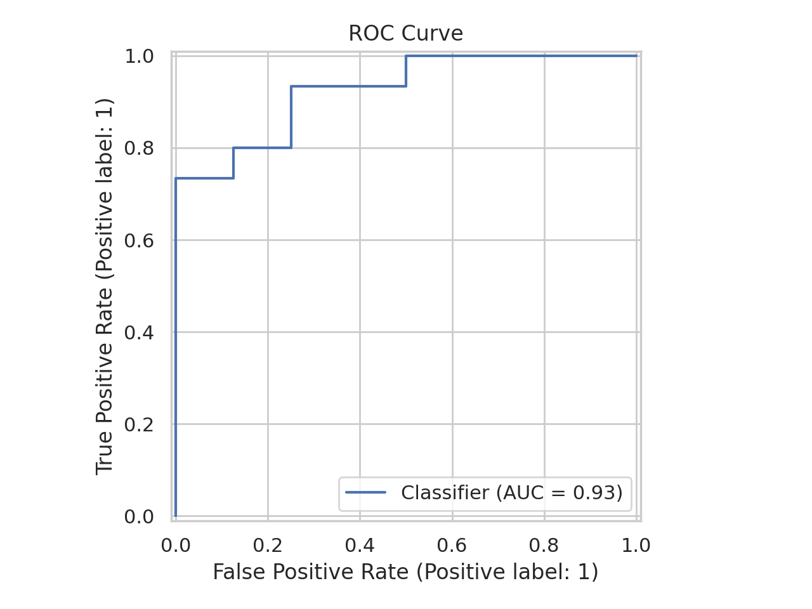
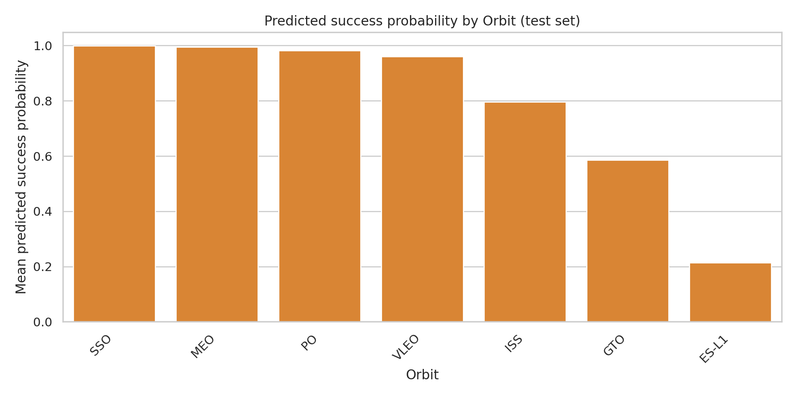
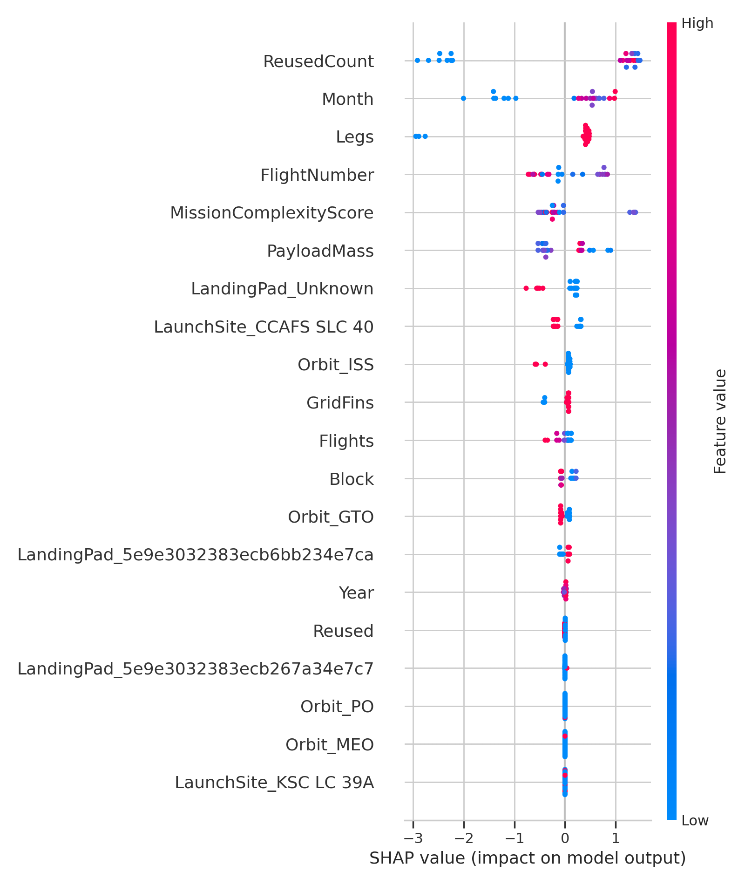

# SpaceX Launch Success Prediction 🚀

Predicting the success of SpaceX rocket launches using mission parameters, payloads, and rocket configurations with machine learning.

---

## Repository Structure

```text
SpaceX_Launch_Success_Prediction/
├── src/
│   └── spacex_pipeline.py        # Main pipeline for data processing, modeling, and evaluation
├── plots/                        # Generated visualizations
│   ├── eda_success_by_orbit.png
│   ├── eda_success_by_site.png
│   ├── eda_payload_vs_outcome.png
│   ├── confusion_matrix.png
│   ├── roc_curve.png
│   ├── orbit_vs_pred_success.png
│   ├── shap_summary_dot.png
│   └── shap_summary_bar.png
├── models/                       # Saved model artifacts
│   ├── model_xgb.joblib
│   ├── metrics.json
│   └── run_manifest.json
├── dataset_part_2.csv            # Dataset with target `Class` (1=success)
└── README.md


---

## Dataset

- **File:** `dataset_part_2.csv`  
- **Target:** `Class` (1 = success, 0 = failure)  
- **Features:**  
  - Payload mass  
  - Orbit type  
  - Launch site  
  - Engineered `MissionComplexityScore`  

---

## Exploratory Data Analysis (EDA)

### Success by Orbit
  
- LEO (Low Earth Orbit) launches have the highest success rate.  

### Success by Launch Site
  
- CCAFS LC-40 and KSC LC-39A sites have consistently higher success rates.  

### Payload Mass vs Outcome
  
- Higher payloads slightly reduce success probability.  

---

## Feature Engineering

- **One-Hot Encoding (OHE):** Categorical features like `Orbit` and `LaunchSite`.  
- **MissionComplexityScore:** Combines payload mass, orbit difficulty, and rocket version complexity.  

---

## Modeling

- **Algorithm:** XGBoost classifier  
- **Pipeline:** OHE + MissionComplexityScore + XGBoost  
- **Artifacts:**  
  - `models/model_xgb.joblib`  
  - `models/metrics.json`  
  - `models/run_manifest.json`  

---

## Model Performance

| Metric    | Value   |
|-----------|---------|
| Accuracy  | 0.8261  |
| Precision | 0.8235  |
| Recall    | 0.9333  |
| F1 Score  | 0.8750  |
| ROC AUC   | 0.9250  |

---

## Modeling Visualizations

### Confusion Matrix
  

### ROC Curve
  

### Predicted Success by Orbit
  

---

## SHAP Feature Importance

### Summary Dot Plot
  

### Summary Bar Plot
  

- **Key Insights:**  
  - MissionComplexityScore and Payload Mass are the most influential features.  
  - Orbit type and launch site also impact predictions.

---

## Usage

```bash
# Clone the repo
git clone https://github.com/silverfrost702/Projects.git

# Navigate to project folder
cd Projects/SpaceX_Launch_Success_Prediction

# Install dependencies
pip install -r requirements.txt

# Run the pipeline
python src/spacex_pipeline.py

