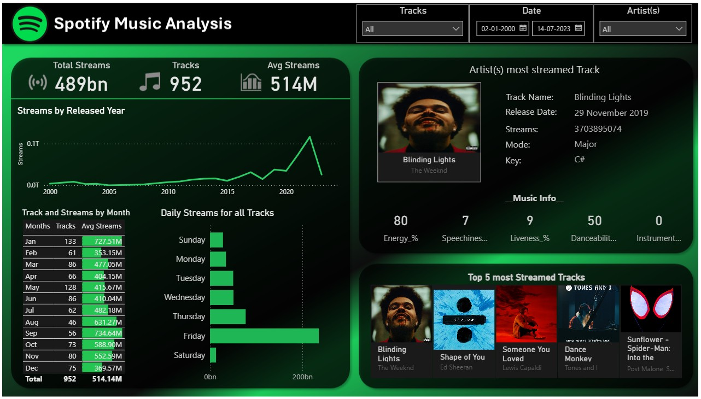

# 🎵 Spotify Music Analysis Dashboard (Power BI)

## 📊 Overview
This project presents an interactive **Spotify Music Analysis Dashboard** built in **Power BI**, designed to visualize global music streaming trends, track popularity, and artist performance metrics.  

The dashboard allows users to explore Spotify data across years, artists, and tracks — making it both **analytically rich** and **visually intuitive**.

---

## 🧠 Key Highlights
- **Total Streams:** 489 Billion  
- **Tracks Analyzed:** 952  
- **Average Streams per Track:** 514 Million  

---

## 🧩 Dashboard Design & Features

The dashboard combines multiple Power BI visuals and interactive components to create a rich, engaging analytical experience.

### 🎚️ Interactive Controls
- **Date Range Slicer:** Filter data by release year range.  
- **Artist Dropdown:** Narrow down all visuals to a selected artist.  
- **Track Dropdown:** Focus on a specific track to see its metrics.  
- **Dynamic Titles:** Automatically update to reflect slicer selections.

---

### 📈 Visuals and Charts

#### 1. **Streams by Released Year (Line Chart)**
- Displays how total streams have evolved over time.  
- Highlights the rapid growth of the music streaming industry post-2015.

#### 2. **Track and Streams by Month (Bar Chart)**
- Shows both the number of tracks and total streams by month.  
- Useful for identifying seasonal or monthly listening patterns.

#### 3. **Daily Streams for All Tracks (Horizontal Bar Chart)**
- Breaks down daily listening habits across the week.  
- Reveals **Friday** as the most active streaming day (likely due to new releases).

#### 4. **Artist’s Most Streamed Track (Card + Image Visual)**
- Highlights the top-performing track for a selected artist.  
- Displays:
  - Track Name  
  - Release Date  
  - Total Streams  
  - Musical Key & Mode (Major/Minor)

#### 5. **Top 5 Most Streamed Tracks (Multi-Row Card with Album Covers)**
- Visually appealing section showing album artwork of the most streamed songs.  
- Quickly communicates which tracks dominate global charts.

#### 6. **Music Information Metrics (KPI Cards)**
- Displays song-level attributes for the selected track:
  - Energy (%)  
  - Speechiness (%)  
  - Liveness (%)  
  - Danceability (%)  
  - Instrumentalness (%)  

These metrics allow comparisons between tracks based on their musical qualities.

---

## 🗂️ Project Structure
Spotify Music Analysis/
│
├── Dashboard.pbix # Power BI dashboard file
├── Spotify Dataset.csv # Spotify dataset used for analysis
├── dashboard_screenshot.png # Screenshot used in this README
└── README.md # Project documentation


---

## 🧹 Data Cleaning & Modeling
Data preparation was done in **Power Query**, involving:
- Removing null or duplicate records  
- Converting date fields and data types  
- Renaming and standardizing column names  
- Creating calculated measures and KPIs using **DAX**

**Key DAX Measures:**
- `Total Streams = SUM(spotify[Streams])`  
- `Avg Streams per Track = AVERAGE(spotify[Streams])`  
- `Tracks Count = COUNTROWS(spotify)`  

Relationships were established between track metadata and audio feature tables to enable cross-filtering across visuals.

---

## 🧮 Power BI Techniques Used
- **Power Query** for data transformation  
- **DAX** for calculated metrics and KPIs  
- **Dynamic Slicers** for filtering by artist, track, and year  
- **Cross-filtering** for interactive visuals  
- **Conditional Formatting** to highlight top-performing tracks  
- **Consistent Color Scheme:** Spotify’s green-on-black aesthetic  

---

## 🖼️ Dashboard Preview


> The dashboard uses Spotify’s dark theme for a professional and brand-consistent look while maintaining clear visual contrast.

---

## 🚀 How to Use
1. Clone or download the repository:
   ```bash
   git clone https://github.com/yourusername/spotify-music-analysis.git
2. Open Dashboard.pbix in Power BI Desktop.
3. Update the data source path if needed:
    - Go to Transform Data → Data Source Settings → Change Source
    - Point to your local path for Spotify Dataset.csv
4. Refresh the data and explore using filters, dropdowns, and slicers.


## 💡 Insights 
- Streaming activity has grown exponentially since 2015.
- “Blinding Lights” by The Weeknd is the most streamed track.
- Fridays show the highest stream counts — correlating with release schedules.
- Songs with high energy and danceability tend to perform better globally.

## 🌱 Future Enhancements
-Add artist-level and genre-level comparison pages.
-Integrate Spotify API for live updates.
-Include sentiment or lyrics-based analysis.
-Publish as an interactive Power BI web app.

## 👨‍💻 Author
### Anuva Negi
📧 [anuvanegi@gmail.com]